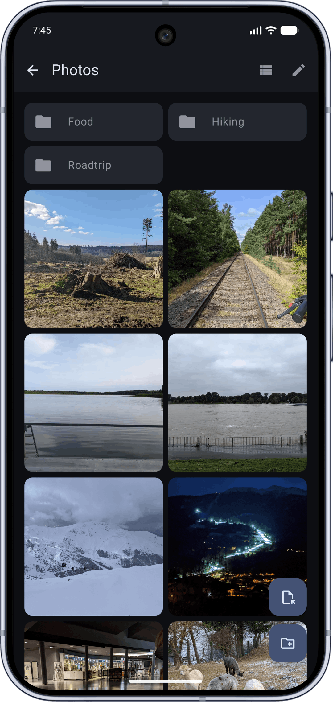
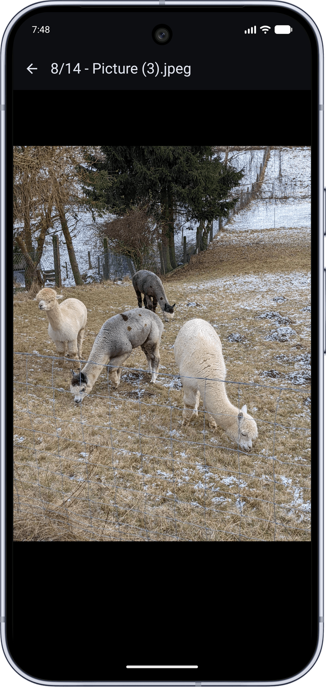

<!--
SPDX-FileCopyrightText: 2022 Lukas Pieper

SPDX-License-Identifier: GPL-3.0-or-later
-->

  

## Pitch

Maybe you're wondering why you should give an underdog file encryption app a chance? Especially when this type of app is
all about trust?

Compared to many other popular alternatives, Truvark...

- [x] supports multiple vaults on a single device
- [x] supports deep folder structures (subfolders)
- [x] decrypts common media files (images, video, audio) in-app on the fly
- [x] works completely offline, no internet access/permission required
- [x] runs without dangerous permissions like full storage/media access
- [x] contains no advertising, telemetry or other user data collection
- [x] encrypts all indices and thumbnails
- [x] allows biometric unlocking (e.g. fingerprint) securely

As you can see, there are already plenty of reasons to give Truvark a try!

  
  

  
  &nbsp;&nbsp;&nbsp;
  

## Documentation

* [Features & Principles](docs/features-principles.md): A more detailed guide on the app's features and core principles
  like *privacy by default* and *security by design*.
* [FAQ](docs/faq.md): Answers to frequently asked questions about the app like vault locking, decrypted file location
  and backup procedures.

## License

This app is licensed under [*GPL-3.0-or-later*](LICENSES/GPL-3.0-or-later.txt).
